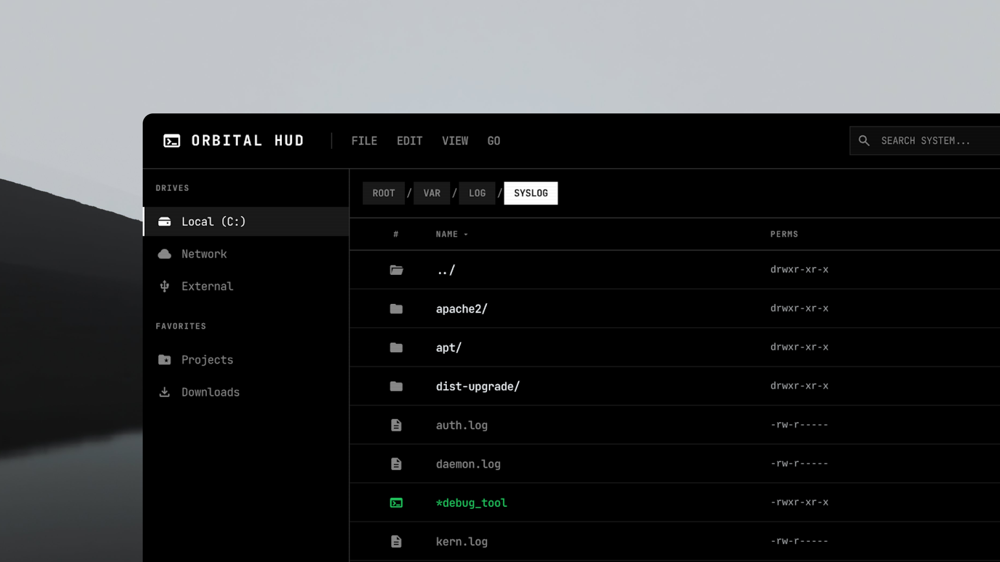

<div align="center">

# 🌌 Orbital HUD



**A blazing fast, terminal-inspired, cyberpunk file manager built in Rust.**

[](https://www.rust-lang.org/)
[](https://github.com/iced-rs/iced)
[](https://opensource.org/licenses/MIT)

</div>

## ⚡ Overview

Welcome to **Orbital HUD** — a next-generation file explorer designed for power users who crave aesthetics and speed. Built from the ground up using [Rust](https://www.rust-lang.org/) and the [Iced GUI framework](https://github.com/iced-rs/iced), Orbital seamlessly blends a dark, hacker-style terminal UI with modern file management capabilities.

Forget traditional, boring file managers. Orbital gives you telemetry, speed, and absolute control.

## 🛠️ Installation & Setup

Ensure you have [Rust](https://rustup.rs/) installed on your machine.

1. **Clone the repository:**
   ```bash
   git clone https://github.com/yourusername/orbital_hud.git
   cd orbital_hud
   ```

2. **Build and run:**
   ```bash
   cargo run --release
   ```

*(Note: Orbital HUD leverages system telemetry. On Linux, ensure `sysinfo` can read system metrics without issues.)*

## 🎯 Architecture

Orbital HUD opts for a clean, modular structure:
- `main.rs`: Core application state, Event loops, and UI assembly.
- `file_entry.rs`: Directory parsing, metadata retrieval, and sorting algorithms.
- `theme.rs`: Custom Iced stylings, color palettes, and component styles.
- `transfer.rs`: Asynchronous file I/O operations and progress tracking.

## 🤝 Contributing

Contributions make the open-source community an amazing place to learn, inspire, and create. Any contributions you make are **greatly appreciated**.

1. Fork the Project
2. Create your Feature Branch (`git checkout -b feature/AmazingFeature`)
3. Commit your Changes (`git commit -m 'Add some AmazingFeature'`)
4. Push to the Branch (`git push origin feature/AmazingFeature`)
5. Open a Pull Request

## 📜 License

Distributed under the MIT License. See `LICENSE` for more information.

---

<div align="center">
  <i>"Speed and elegance, orbiting in harmony."</i>
</div>
